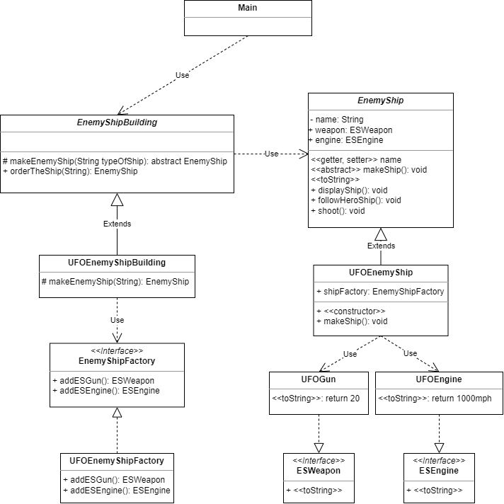

# Definition

It is like a factory, but everything is encapsulated

- The method that orders the object
- The factories that build the object
- The final objects
- The final objects contain objects that use the Strategy Pattern
  - Composition: Object class fields are objects

# When to use

Allows you to create families of related objects without specifying a concrete class
Use when you have many objects that can be added, or changed dynamically during runtime
You can model anything you can imagine and have those objects interact throught common interfaces

The bad: Things can get complicated

# Class diagram

