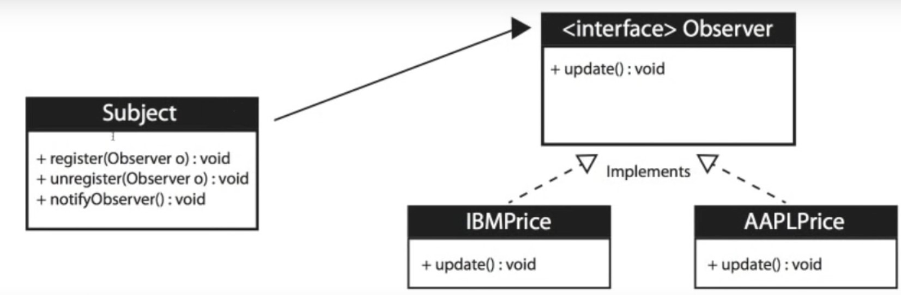

# Definition

An object, called the subject, maintains a list of its dependents, called observers, and notifies them automatically of any state changes, usually by calling one of their methods.

# When to use

When you need many other objects to receive an update when another object changes

- Stock market with thousands of stocks needs to send updates to objects representing induvidual stocks
- The Subject (publisher) sends many stocks to the Observers
- The Observers (subscribers) tackes the ones they want and use them

Loose coupling is a benefit

- The Subject (publisher) doesn't need to know anything about the Observers (subscribers)

Negatives: The Subject (publisher) may send updates that don't matter to the Observer (subscriber)
